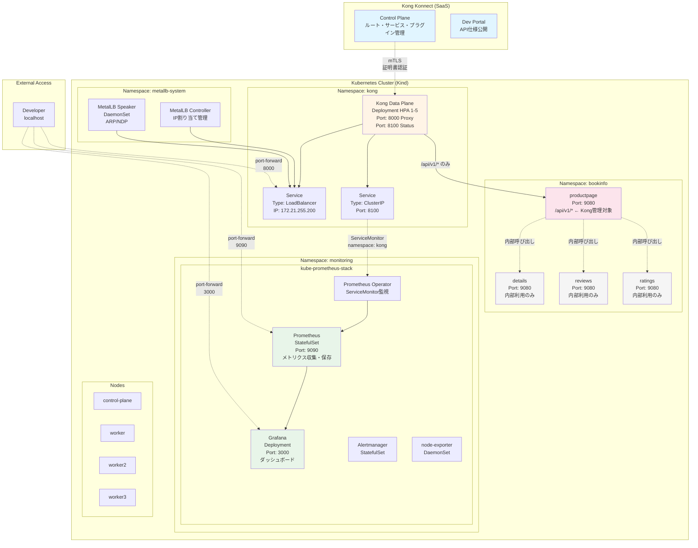
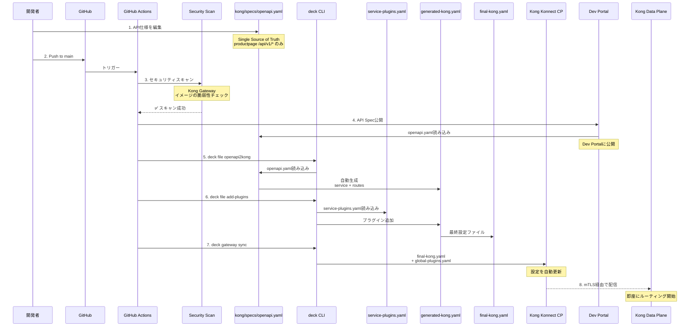
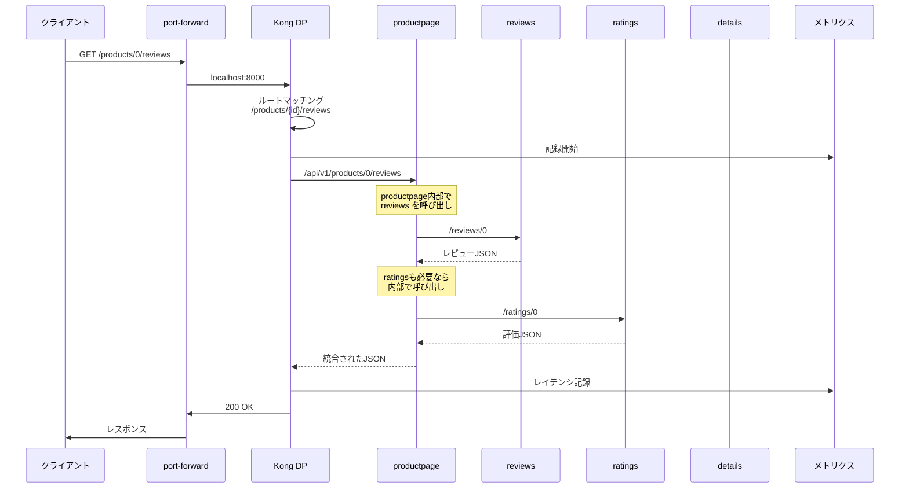
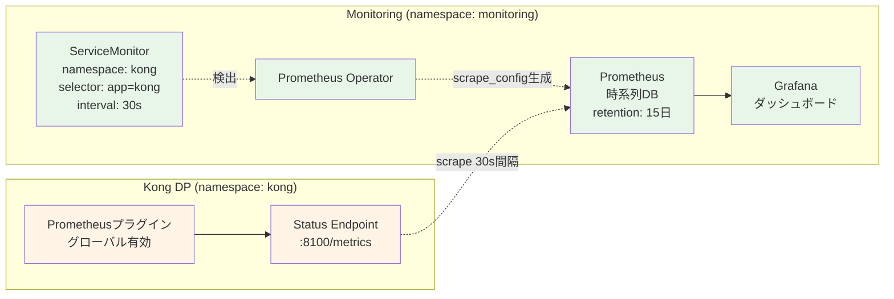
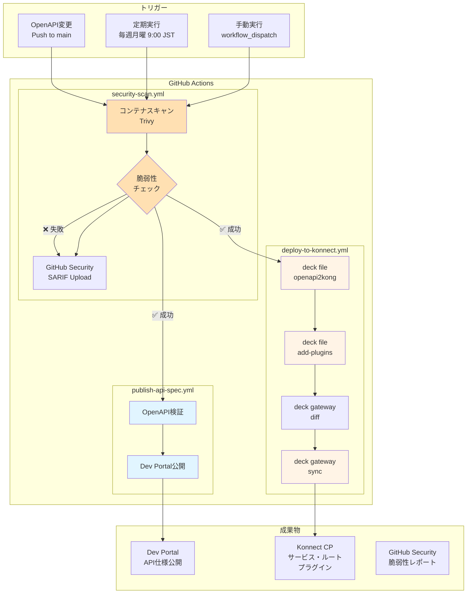
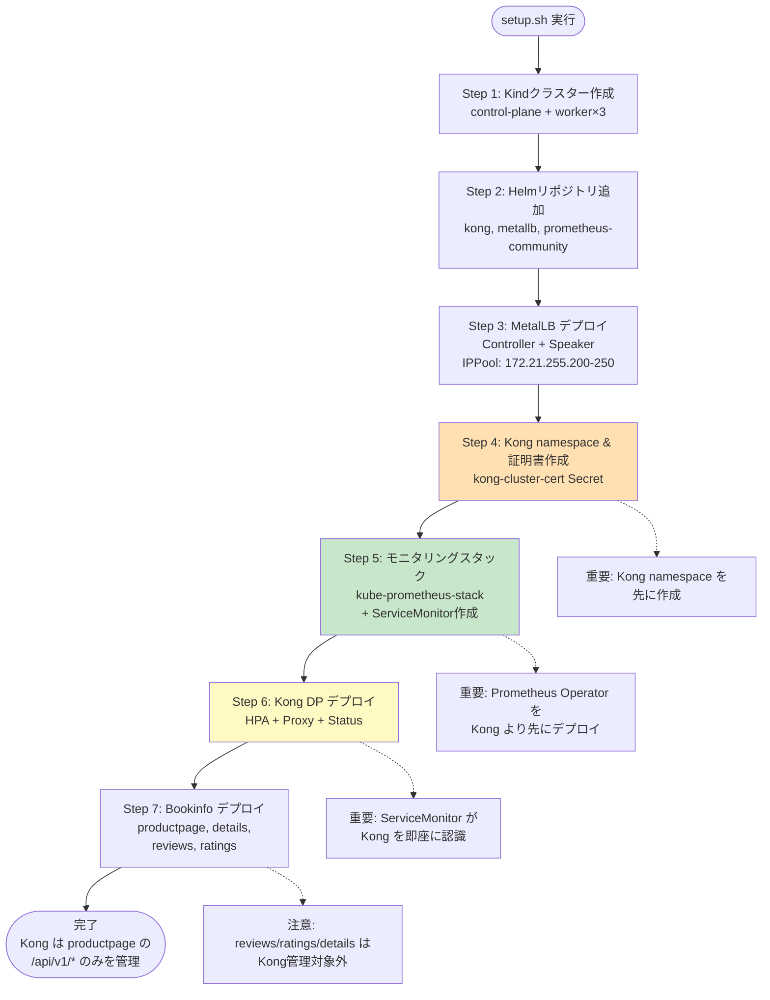
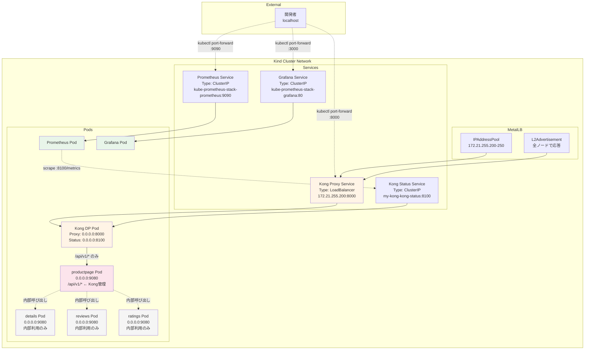

# システムアーキテクチャ

## 全体構成図



## Kong 設定管理フロー (OpenAPI-Driven)



## リクエストフロー



## モニタリングフロー



## CI/CD パイプライン



## デプロイ順序 (setup.sh)



## ネットワーク構成



## コンポーネント一覧

### Kong 関連

| コンポーネント | 種類             | Namespace | ポート                         | 用途            |
| -------------- | ---------------- | --------- | ------------------------------ | --------------- |
| Kong DP        | Deployment (HPA) | kong      | 8000 (Proxy)<br/>8100 (Status) | API Gateway     |
| Proxy Service  | LoadBalancer     | kong      | 8000                           | 外部アクセス    |
| Status Service | ClusterIP        | kong      | 8100                           | メトリクス公開  |
| ServiceMonitor | Custom Resource  | kong      | -                              | Prometheus 連携 |

### Bookinfo 関連

| コンポーネント | 種類                 | Namespace | ポート | 用途                     | Kong 管理 |
| -------------- | -------------------- | --------- | ------ | ------------------------ | --------- |
| productpage    | Deployment + Service | bookinfo  | 9080   | API 統合サービス         | ✅        |
| details        | Deployment + Service | bookinfo  | 9080   | 書籍詳細（内部利用のみ） | ❌        |
| reviews        | Deployment + Service | bookinfo  | 9080   | レビュー（内部利用のみ） | ❌        |
| ratings        | Deployment + Service | bookinfo  | 9080   | 評価（内部利用のみ）     | ❌        |

**注意:** Kong は `productpage` の `/api/v1/*` エンドポイントのみを管理します。

### モニタリング関連

| コンポーネント      | 種類        | Namespace  | ポート | 用途                 |
| ------------------- | ----------- | ---------- | ------ | -------------------- |
| Prometheus          | StatefulSet | monitoring | 9090   | メトリクス収集・保存 |
| Grafana             | Deployment  | monitoring | 3000   | ダッシュボード       |
| Prometheus Operator | Deployment  | monitoring | -      | ServiceMonitor 監視  |
| Alertmanager        | StatefulSet | monitoring | 9093   | アラート管理         |
| node-exporter       | DaemonSet   | monitoring | 9100   | ノードメトリクス     |

### インフラ関連

| コンポーネント     | 種類       | Namespace      | ポート | 用途         |
| ------------------ | ---------- | -------------- | ------ | ------------ |
| MetalLB Controller | Deployment | metallb-system | -      | IP 割り当て  |
| MetalLB Speaker    | DaemonSet  | metallb-system | -      | ARP/NDP 応答 |

## メトリクス例

Kong が収集するメトリクス（ServiceMonitor 経由で Prometheus に送信）:

```promql
# リクエスト総数（単一サービス bookinfo-api）
kong_http_requests_total{service="bookinfo-api", code="200"}

# レイテンシ（ヒストグラム）
kong_latency_bucket{type="request", service="bookinfo-api", le="100"}

# 帯域幅
kong_bandwidth_bytes{type="egress", service="bookinfo-api"}
```

Grafana で可視化可能なクエリ:

```promql
# リクエストレート（1分間の平均RPS）
sum(rate(kong_http_requests_total[1m])) by (service)

# エラーレート
sum(rate(kong_http_requests_total{code=~"5.."}[1m])) / sum(rate(kong_http_requests_total[1m]))

# P95レイテンシ
histogram_quantile(0.95, sum(rate(kong_latency_bucket[1m])) by (le))

# サービス別リクエスト数
sum(kong_http_requests_total) by (service)
```

## 参考リンク

- [Kong Gateway Documentation](https://docs.konghq.com/gateway/latest/)
- [Kong Konnect](https://docs.konghq.com/konnect/)
- [Bookinfo Application](https://istio.io/latest/docs/examples/bookinfo/)
- [Prometheus Operator](https://prometheus-operator.dev/)
- [Grafana Dashboards](https://grafana.com/grafana/dashboards/)
- [MetalLB](https://metallb.universe.tf/)
- [Kind](https://kind.sigs.k8s.io/)
